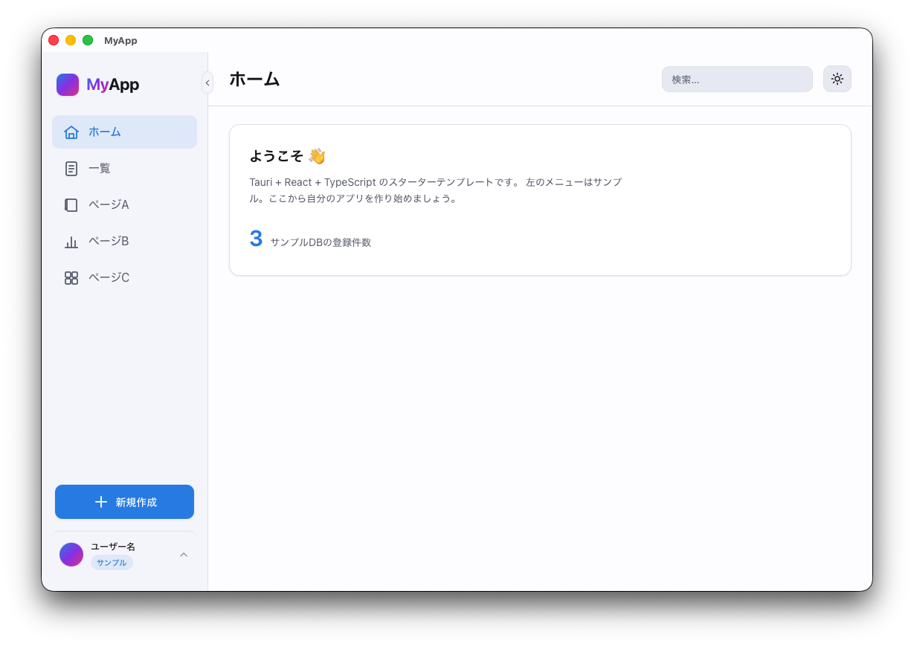
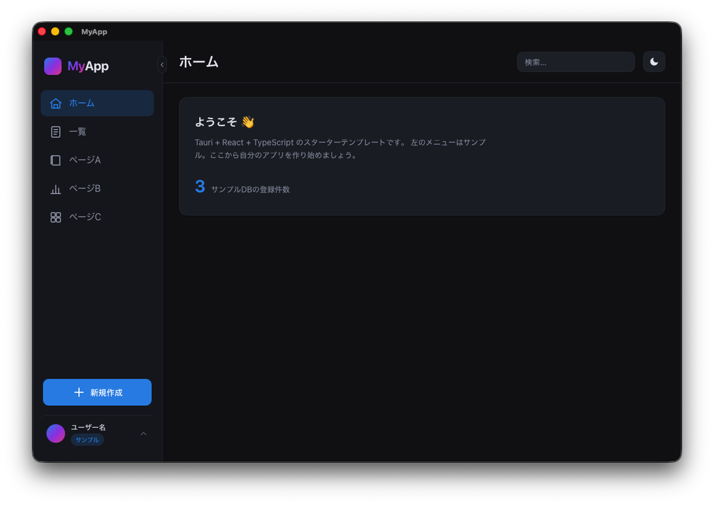

# tauri-react-starter

**Tauri v2 + React + TypeScript + Rust + SQLite** のデスクトップアプリ用スターターテンプレート。
新しいアプリを、環境構築ゼロから始めずに「動く土台」からスタートするための雛形です。

> このテンプレートは Mac / Windows / Linux のデスクトップアプリを作れます。
> Tauri v2 は同じコードから **iOS / Android** も出せるので、将来モバイルに広げることもできます。

<p align="center">
  
  
</p>
<p align="center"><sub>ライト / ダークの両テーマに対応したアプリシェル</sub></p>

---

## 🚀 はじめ方（おすすめ：Claude Code でキックオフ）

このテンプレートは **Claude Code と会話しながら立ち上げる**設計です。

```bash
git clone https://github.com/hachiyumolab/tauri-react-starter.git my-app
cd my-app
claude                       # Claude Code を起動
```

起動すると、Claude が「まだテンプレート状態だよ。一緒に立ち上げよう」と**壁打ちを提案**してきます。
自分から始めたいときは、Claude Code 内で次を打つだけ：

```
/kickoff
```

kickoff では、Claude が順に質問しながら **①作るものの壁打ち → ②要件 → ③技術選定（対象OS・データの持ち方など）→ ④雛形へ反映（アプリ名の置換・不要な部品の撤去・docs更新）** まで案内します。
（手作業で名前だけ変えたい人は、下の「最初のカスタマイズ」を参照）

---

## 何が入っているか

- ✅ **アプリシェルUI**：サイドバー（折りたたみ／アイコンレール／モバイルはドロワー）＋トップバー＋テーマ切替（ライト/ダーク）
- ✅ **デザインシステム**：色・文字・余白を CSS変数（トークン）で定義（[`docs/design.md`](docs/design.md) / [`docs/styleguide.html`](docs/styleguide.html)）
- ✅ **データ層のサンプル**：SQLite（`rusqlite`）＋マイグレーション＋サンプルデータ＋一覧取得コマンド（`DB → Rust → 画面` が動く見本）
- ✅ **レスポンシブ**：広い＝全開サイドバー／中間＝アイコンレール／モバイル＝ドロワー
- ✅ **学習用ドキュメント**：用語集・要件/設計テンプレ

---

## 技術スタック

| 領域 | 技術 |
|---|---|
| アプリ枠 | Tauri v2（Mac / Windows / Linux、将来モバイル） |
| UI | TypeScript + React + Vite |
| 中核ロジック | Rust |
| データ | SQLite（`rusqlite`、本体同梱） |

---

## クイックスタート

### 事前準備（初回のみ）
- **Node.js**（推奨：nvm で管理）
- **Rust**（`rustup` でインストール）
- Tauri の前提ツール → 公式の [Prerequisites](https://tauri.app/start/prerequisites/) を参照

### 起動

```bash
npm install          # 依存をインストール
npm run tauri dev    # 開発モードで起動（ホットリロードあり）
```

### ビルド（配布用）

```bash
npm run tauri build  # OSごとのインストーラを生成
```

---

## 最初のカスタマイズ（アプリ名などの差し替え）

新しいアプリを始めるときは、まず以下を自分の名前に置き換えます。

| 変える場所 | ファイル | いまの値 |
|---|---|---|
| ウィンドウのタイトル・製品名 | `src-tauri/tauri.conf.json` | `MyApp` |
| アプリ識別子（逆ドメイン） | `src-tauri/tauri.conf.json` | `com.example.myapp` |
| 画面左上のロゴ文字 | `src/App.tsx`（`wordmark`） | `MyApp` |
| ブラウザタブのタイトル | `index.html` | `MyApp` |
| npm パッケージ名 | `package.json` | `tauri-react-starter` |
| アプリアイコン | `src-tauri/icons/`（一式を差し替え） | 仮アイコン |

> アイコンは 1枚の元画像から `npm run tauri icon path/to/icon.png` で全サイズを自動生成できます。

---

## フォルダ構成

```
tauri-react-starter/
├─ src/                  # フロント（React + TypeScript）
│  ├─ App.tsx            # アプリシェル（サイドバー・テーマ・レスポンシブ）
│  ├─ index.css          # デザイントークン（CSS変数の実体）
│  ├─ App.css            # アプリシェルのスタイル
│  └─ screens/           # 各画面（Home / Items / ComingSoon）
├─ src-tauri/            # バックエンド（Rust / Tauri）
│  ├─ src/
│  │  ├─ lib.rs          # エントリ・コマンド定義
│  │  ├─ db.rs           # DB層（接続・マイグレーション・読み取り）
│  │  └─ main.rs         # 起動
│  └─ tauri.conf.json    # アプリ設定（名前・識別子・ウィンドウ）
└─ docs/                 # ドキュメント
```

---

## ドキュメント

- 要件テンプレ：[`docs/requirements.md`](docs/requirements.md)
- 設計（アーキテクチャ）：[`docs/architecture.md`](docs/architecture.md)
- デザインシステム：[`docs/design.md`](docs/design.md)
- スタイル見本（HTML）：[`docs/styleguide.html`](docs/styleguide.html)
- 用語集（学習用）：[`docs/glossary.md`](docs/glossary.md)
- 変更履歴：[`CHANGELOG.md`](CHANGELOG.md)

---

## ライセンス

このテンプレート本体は [MIT ライセンス](LICENSE)（© 2026 HachiyumoLab）です。自由に使えます。
※ このテンプレートから作る各プロダクトのライセンスは、`/kickoff` の中で別途選べます。
